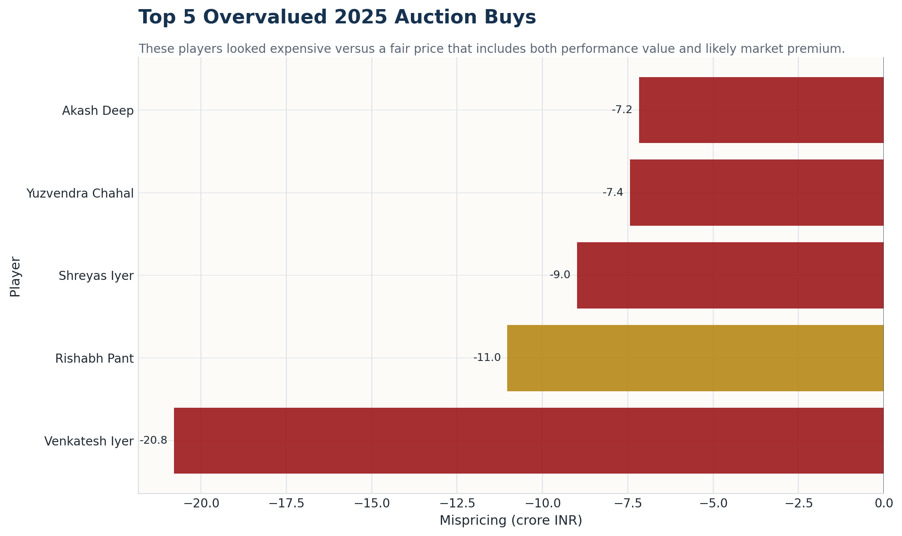
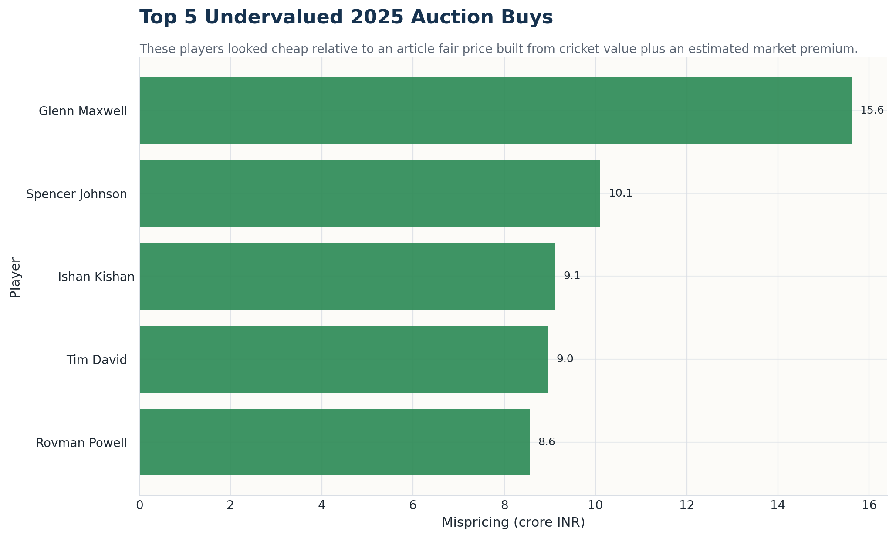
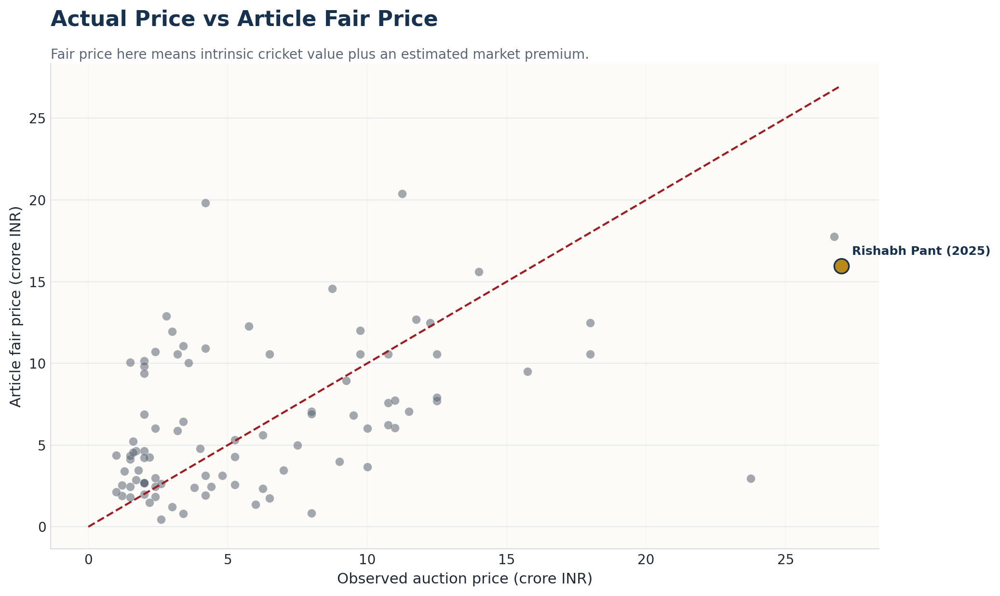
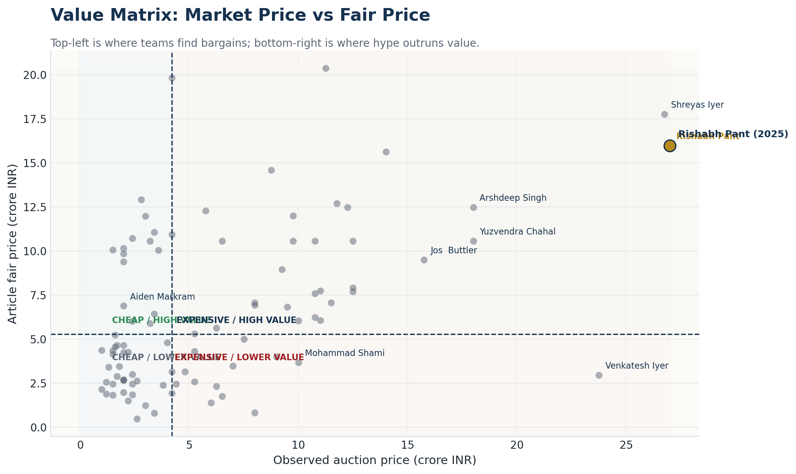
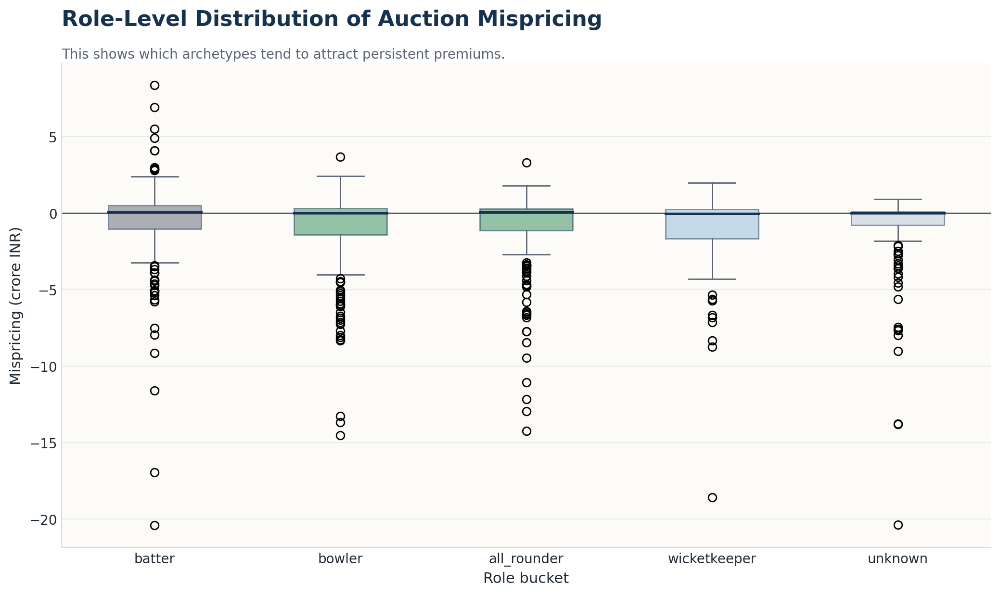
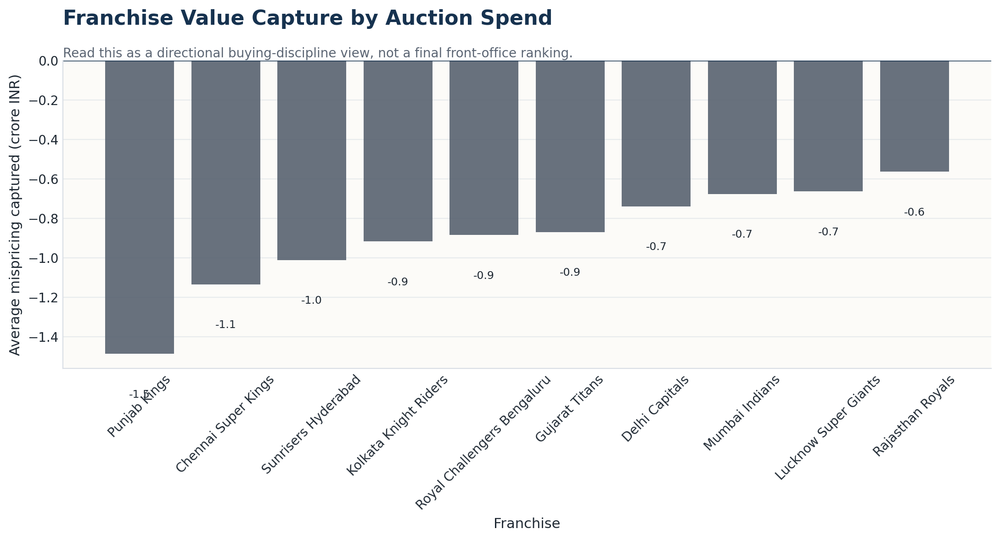

# IPL 2025: What teams really paid for vs what they got

The IPL auction sells hope at full market price.

That price is not based only on runs, wickets, or last season's highlights. Franchises pay for scarcity. They pay for wicketkeepers who can bat in the middle order. They pay for left-arm quicks who can bowl the hard overs. They pay for Indian batters who reduce overseas-slot pressure. They pay for pedigree, leadership, reputation, and the fear of leaving the room without a role the squad badly needs.

That is what makes the auction such an interesting market. It is not random. It is noisy.

This piece asks a simple question: in the 2025 auction, where did teams pay a premium they could defend, and where did the number run too far ahead of what the player was likely to return?

To answer it, the project built a fair-price estimate for each player using only information available before the 2025 season began. Recent IPL performance formed the base. Multi-year IPL pedigree, role scarcity, previous auction history, keeping value, captaincy value, death-bowling value, and SENA pedigree were layered on top. Under the hood, the final fair-price model is a gradient-boosted regression model trained on past auction outcomes, using normalized performance metrics and role-based premium indicators. The result is not meant to be a perfect "true price". It is a disciplined benchmark for asking whether a bid looked sensible.

To keep the season review honest, the ten case studies below only use players who featured in at least `10` matches in IPL 2025.

## What the market paid up for

The expensive end of the 2025 auction was not full of bad cricketers. In fact, that is precisely why it is worth studying. Teams often paid up for players with real value, then paid a little more because the role itself was hard to replace.

Shreyas Iyer is the cleanest example. Punjab Kings paid `26.75 crore`; the model's fair range lands at roughly `17.76 crore`. That is a meaningful premium, but not an absurd one. It reflects what the market does with Indian top-order batters who bring captaincy credibility. Shreyas then answered with `604` runs at a strike rate of `175.1`. He still looked expensive at the point of sale, but he also showed why teams keep paying for that profile.

Rishabh Pant sits at the other end of that spectrum. Lucknow Super Giants paid `27.0 crore` and the model came in at `15.98 crore`. Even after pricing in wicketkeeping scarcity and leadership value, the gap remained large. Pant's season returned `269` runs at a strike rate of `133.2`, which makes this the clearest case where the output did not fully justify the fee.

Arshdeep Singh, Yuzvendra Chahal, and Jos Buttler round out the expensive shortlist. Arshdeep's final number still looks rich, but his `21` wickets at `8.88` economy show why Indian high-leverage quicks command a premium. Chahal's season was useful rather than dominant. Buttler remained productive, but Gujarat still paid a price that sat above the model's clearing estimate.

### The five richest premium bets, and what followed

| Player | Team | Price | Fair price | 2025 statline | Verdict |
|---|---|---:|---:|---|---|
| Rishabh Pant | Lucknow Super Giants | 27.00 cr | 15.98 cr | 13 matches, 269 runs, 133.2 SR | Flop |
| Shreyas Iyer | Punjab Kings | 26.75 cr | 17.76 cr | 17 matches, 604 runs, 175.1 SR | Hit |
| Yuzvendra Chahal | Punjab Kings | 18.00 cr | 10.56 cr | 13 matches, 16 wickets, 9.56 economy, 16.9 BSR | Mid |
| Jos Buttler | Gujarat Titans | 15.75 cr | 9.50 cr | 13 matches, 538 runs, 163.0 SR | Mid |
| Arshdeep Singh | Punjab Kings | 18.00 cr | 12.48 cr | 16 matches, 21 wickets, 8.88 economy, 16.7 BSR | Hit |

The point is not that every expensive buy was wrong. It is that expensive buys carry different kinds of risk. Some, like Shreyas and Arshdeep, still repay the bet on the field. Others, like Pant, leave a much larger gap between what was paid and what actually came back.

## Where the value sat

The more interesting inefficiencies were on the cheaper side of the market.

Ishan Kishan is the standout. Sunrisers Hyderabad bought him for `11.25 crore`; the model's fair price landed at `20.37 crore`. His season was not the best in the league, but `354` runs at `152.6` strike rate from a rare Indian wicketkeeper-batter profile still make that fee look light.

Krunal Pandya was another classic auction value play: not glamorous, but structurally useful. Royal Challengers Bengaluru paid `5.75 crore`; the model came in at `12.28 crore`. He then returned `17` wickets at `8.24` economy. That is exactly the kind of multi-skill utility the room can underrate while chasing bigger names.

Aiden Markram fits the same pattern. Lucknow Super Giants paid only `2.0 crore` for a player who went on to produce `445` runs at `148.8` strike rate, while also chipping in with the ball. Devdutt Padikkal gave Royal Challengers Bengaluru low-cost, low-risk top-order value. Nitish Rana is the interesting miss on this side: the model liked the price, but the season did not fully back it up, and role usage never quite let the bet breathe.

### The five best value bets, and what followed

| Player | Team | Price | Fair price | 2025 statline | Verdict |
|---|---|---:|---:|---|---|
| Ishan Kishan | Sunrisers Hyderabad | 11.25 cr | 20.37 cr | 13 matches, 354 runs, 152.6 SR | Hit |
| Devdutt Padikkal | Royal Challengers Bengaluru | 2.00 cr | 10.14 cr | 10 matches, 247 runs, 150.6 SR | Mid |
| Nitish Rana | Rajasthan Royals | 4.20 cr | 10.93 cr | 11 matches, 217 runs, 161.9 SR | Flop |
| Krunal Pandya | Royal Challengers Bengaluru | 5.75 cr | 12.28 cr | 15 matches, 17 wickets, 8.24 economy, 16.2 BSR | Hit |
| Aiden Markram | Lucknow Super Giants | 2.00 cr | 6.88 cr | 13 matches, 445 runs, 148.8 SR, 4 wickets | Hit |

That split is what gives the broader argument some weight. The expensive side did not collapse. The value side did not go five-for-five either. But the cheaper shortlist did a better job of turning rupees into useful cricket.

## The market view in one glance

The bigger market picture helps explain why.

The scatter plot shows how widely final auction prices can drift from the modelled fair range. The quadrant view makes the same point in more intuitive terms: some players were expensive and productive, others were expensive without enough return, while the most attractive buys sat in the cheaper-and-better-value corner.

At the role level, pricing gets messiest where scarcity is real. Wicketkeeper-batters, death bowlers, and high-quality Indian core players are exactly the profiles that can make simple stat-based thinking break down. At team level too, some franchises appear to have done a better job than others of converting spend into value captured.

## What the season actually said

The 2025 season did not support a lazy "big-money buys flop" story.

Instead, it pointed to something more useful. The auction tends to overpay for scarcity, but that scarcity is often real. Shreyas and Arshdeep were expensive, and still delivered. Buttler remained productive enough to avoid being called a bad buy. Pant is the clearest warning case: a premium role, a premium fee, and not enough cricketing return.

The value side gave the sharper result. Kishan, Krunal, and Markram all strengthened the case that the market still leaves room for quiet value buys in structurally important roles. Devdutt looked like a sensible low-cost contributor rather than a breakout star. Nitish is the reminder that even a good-looking price does not guarantee a good season, especially when role usage limits output.

That is the more honest conclusion. IPL auctions are not full of irrational prices. They are full of understandable premiums, some of which run too high. The IPL auction does not consistently misprice talent. It misprices how much scarcity is worth.

## What a front office would take from this

1. Scarcity deserves a premium, but not a blank cheque. The market is usually right about which roles matter most; it is less reliable on how much extra those roles are worth.
2. Multi-year IPL pedigree matters. One mediocre season should not erase years of proof, especially for players in scarce roles.
3. The calmer value often sits one rung below the glamour tier. Franchises that avoid room-temperature panic are more likely to find it.

## What this could mean next

If this pattern holds into the next auction cycle, teams should expect three things.

1. Proven wicketkeeper-batters and Indian core batters will keep attracting a premium, because the replacement pool remains thin.
2. High-leverage bowlers will keep being expensive, but the smartest teams will be more selective about which fast bowlers truly belong in the top price tier.
3. The most repeatable bargains will still sit just below the headliner band: players with clear role utility, solid IPL memory, and less room-temperature hype.

## Appendix

### In plain English, what the model is doing

The model starts with a simple idea:

`fair price = cricketing base value + market premium`

The cricketing base value asks: if we looked only at recent IPL evidence, how strong was this player likely to be going into the 2025 season?

The market premium asks: what extra does the auction usually pay for this kind of player, even before a ball is bowled?

### What went into the cricketing base value

For batters, the model gave most weight to:

- runs
- strike rate
- runs per innings
- boundary scoring and scoring tempo

For bowlers, it gave most weight to:

- wickets
- economy rate
- bowling strike rate
- whether wickets came in high-pressure phases such as the powerplay or death overs

For all-rounders, it blended both sides.

It also remembered more than one season. Recent form mattered most, but multi-year IPL pedigree mattered too. That helped stop the model from being too harsh on players with long records of success.

### What counted as market premium

The market premium layer added things IPL teams repeatedly pay extra for:

- wicketkeeper scarcity
- captaincy credibility
- Indian batting depth
- left-arm and death-bowling skill
- control bowling
- previous auction reputation
- multi-year IPL pedigree
- SENA premium for certain overseas buys from South Africa, England, New Zealand, and Australia

This matters because IPL teams are not buying only last season's scorecard. They are buying replacement difficulty.

### How hindsight bias was avoided

The pricing model only used information available before IPL 2025 began.

That means:

- 2024 performance was the main recent input for 2025 prices
- earlier IPL pedigree and prior auction history were allowed
- 2025 outcomes were not used to set the 2025 fair prices

The 2025 season was used only afterwards, as a check on whether the expensive calls and value calls held up.

### How the `hit / mid / flop` labels work

The follow-up review does not use fan sentiment. It uses role-aware season return.

- Batters are judged on runs, strike rate, and runs per innings
- Bowlers are judged on wickets, economy, and bowling strike rate
- All-rounders are judged on both
- Captains get a small extra adjustment based on how their team's finish changed from 2024 to 2025

Each player is then ranked against others in his role bucket.

- Bottom `40%` of that role group: `Flop`
- Middle band from `40%` to `75%`: `Mid`
- Top `25%`: `Hit`

The shortlist in the article only includes players who played at least `10` matches in IPL 2025, so that the follow-up section is not distorted by tiny samples or non-playing squad members.

### How accurate the pricing model was

The final market-facing model was selected on holdout-year testing rather than on how well it fit one specific auction.

Its holdout metrics were:

- `MAE (log price): 0.68`
- `RMSE (log price): 0.93`
- `R²: 0.50`

In plain English, that is good enough to be useful, but not precise enough to treat every fair price as an exact rupee verdict. A player shown at `16 crore` fair should be read as belonging to that broad price neighbourhood, not as being "worth exactly 16.00". As a practical reading rule rather than a formal confidence interval, many players will sit within a rough `+/- 30% to 40%` band around the estimate in a noisy auction market.

### What the model will still miss

- Internal medical information
- Dressing-room fit and franchise preference
- Real-time bidding wars
- Owner behaviour
- Overseas-slot strategy specific to one squad
- The fact that some roles are so scarce that teams knowingly overpay anyway

That is why this piece should be read as a market analysis, not as a claim that the model knows the one true price of a cricketer.
